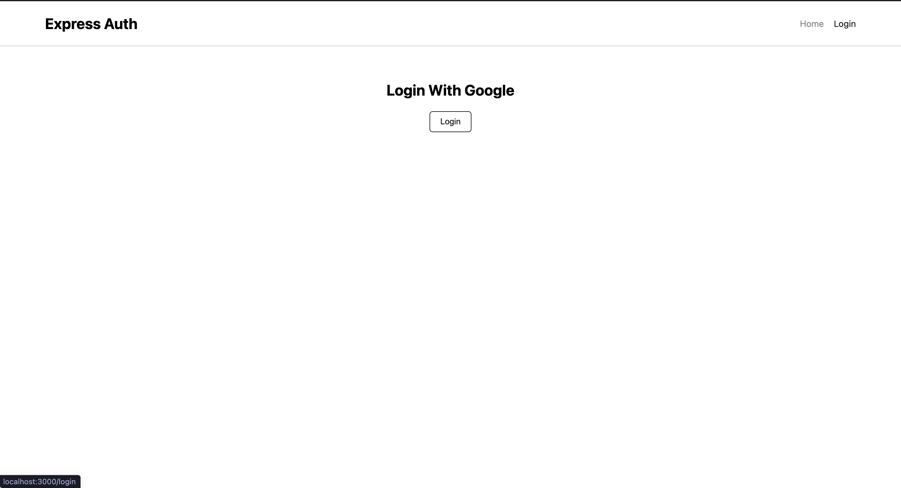
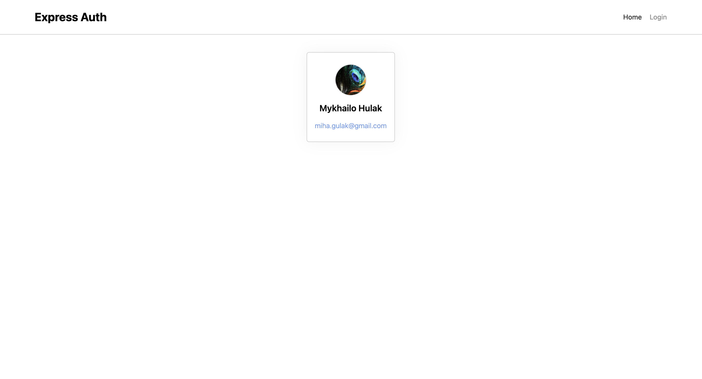

# Express Google Authentication




## Technologies


## Description

Fullstack app to showcase how google auth can be done with Passport backend library.

## Installation

-   Create a new project on google cloud platform
-   Follow [this](https://youtu.be/TKnnrGU9MFw?si=RUbJ3RjKTFT7n3eR) tutorial to setup a consent screen, grab your credentials
-   Create a new cluster at [mongodb](https://www.mongodb.com/) and copy a connection string
-   Clone repo with

`git clone https://github.com/midjiro/express-google-auth.git`

-   Create a default.json file inside of server/config folder with the following code

```
    {
        "CLIENT_ID": "...",
        "CLIENT_SECRET": "...",
        "SESSION_SECRET": "...",
        "CONNECTION_STRING": "...",
        "PORT": 3001
    }
```

-   Replace dots by copied data,your session secret key and mongodb connection string.

-   Run `npm install` both in client and server directories

-   You are ready to start!

## Contact

Hulak Mykhailo

[Send me an email](miha.gulak@gmail.com)

[Find me on telegram](https://t.me/@midjiro)

## Feature Development & Support

While working with new project i faced and passed through a lot of obstacles so there are a lot of stuff do be added here.
